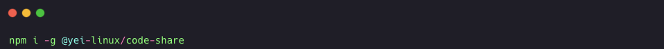

# 🔐 Code Share CLI



A developer-friendly CLI that turns any project (JavaScript, TypeScript, Java, etc.) into a **single Base64 `.txt` file**, and allows you to restore it later — encrypting the content with your password chosen if you want.

> Ideal for quick sharing, backups, archiving, or shipping prototypes without needing Git.

---

## 🚀 Features

- 📦 **Encode** an entire project (excluding unwanted files) into a encoded `.txt` file.
- 🔁 **Decode** and restore the project exactly as it was.
- 🔍 Respects `.gitignore` or custom rules.
- 🔐 Easy encryption.
- 💼 Useful for freelancers, indie devs and backups without git.

---

## 📦 Installation

```bash
npm install -g @yei-linux/code-share
npx @yei-linux/code-share
```

- 📦 If you want to encode choose "Encode" and then put your secured password(its optional if you want more security). A TXT encoded will be generated where you can save it.

- 🔁 When you want to decode it just choose "Decode" put your password and a folder will be generated with all your folders, files, etc.
